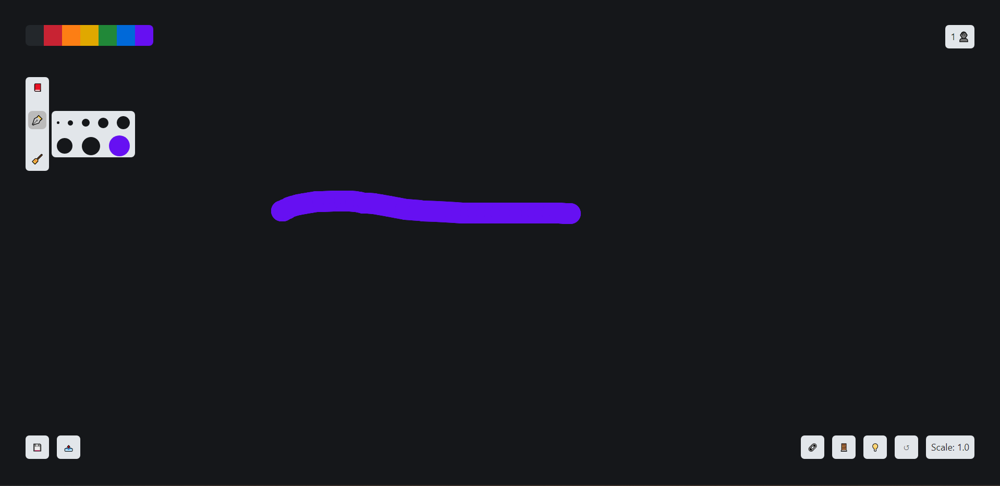

# Collaborative Whiteboard

This is a collaborative whiteboard that allows real-time communication through sockets. It was built using Next.js, Spring Boot and MongoDB. Users can share a room and draw on canvas which will be updated on every participant's screen. 


# Demo


# Local Setup

## Prerequisites
- **Node.js** (v16+)
- **Java** (JDK 17+)
- **MongoDB** (Running locally or on Atlas)

## Running the Server (Spring Boot)
1. Navigate to the `server` directory.
2. Configure your MongoDB connection in `src/main/resources/application.properties` (if applicable).
3. Run the application:
   ```bash
   ./mvnw spring-boot:run
   ```

## Running the Frontend (Next.js)
1. Navigate to the `frontend` directory.
2. Install dependencies:
   ```bash
   npm install
   ```
3. Run the development server:
   ```bash
   npm run dev
   ```
4. Open [http://localhost:3000](http://localhost:3000) in your browser.

# Functionality
When the app is launched, the user must create a room or join an existent one. 
If the user chooses to create a room, a username and a room name is required. Else, to join a room a username and the room ID are required.
* Once the room is created, it will be stored in MongoDB Database.
* Other users can join this room if they know its ID
* Every time a user joins or leaves a room, the message will be broadcasted to all users in that specific room through sockets.
* Each user in a room can draw on canvas, change the width of pencil, erase drawings, save the canvas or import other.
* Each drawing is stored in Database. Drawings are broadcasted as json object which holds coordinates of drawing, color, lineWidth, and the ID of the user who draw it.
